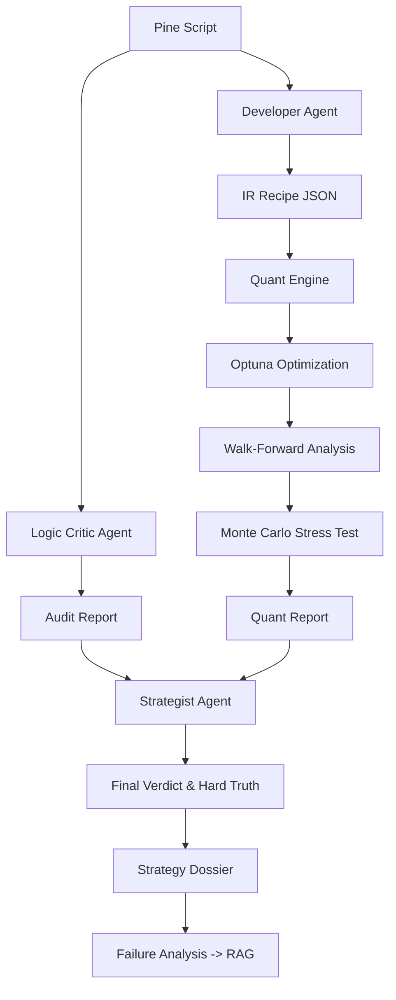

# Optimization Engine Pipeline: Multi-Agent Quant Lab

This document outlines the end-to-end autonomous pipeline for strategy optimization, validation, and assessment within the Optimization Engine.

## Pipeline Overview

The pipeline is orchestrated by `optimization_engine.py` and follows a 7-step multi-agent workflow. It is optimized for 8GB VRAM systems using a sequential model-loading strategy (managed by `vram_manager.py`).

---

### Phase 1: Knowledge Ingestion (RAG)
**File**: `rag.py`  
**Engine**: SQLite + Sentence Transformers (Local)  
The engine begins by seeding its local knowledge base with known Pine Script bugs and repainting patterns.  
- **Detail**: It uses a local vector database to store "Logic Patterns" (e.g., how `request.security` without `lookahead` behaves). During the Critic phase, it retrieves relevant "bug snippets" to provide as context to the LLM.

### Phase 2: Market Context Fetching
**File**: `market_context.py`  
**Engine**: MCP (Model Context Protocol) Tools  
Fetches the current market regime snapshot (Volatility, Trend, Volume) for the target asset.  
- **Detail**: This phase calls `detect_macro_regime()` and `analyze_breadth()` via the Tradier/Market MCP tools. It identifies if the market is currently in a "High Volatility Bull" or "Low Volatility Bear" regime. This context allows the Strategist to judge if the strategy's historical performance aligns with the current market environment.

### Phase 3: The Developer (IR Builder)
**File**: `quant_developer.py`, `ir_builder.py`  
**Model**: `Qwen2.5-Coder-7B` (Available) / Regex Rule Engine (Primary)  
Parses raw Pine Script into a language-agnostic Intermediate Representation (IR).  
- **Logic**:
    - **Input Extraction**: Regex identifies all `input()` calls.
    - **Role Classification**: Automatically tags parameters as `signal` (e.g., RSI Length), `risk` (e.g., Stop Ticks), or `display` (e.g., Label Colors). This ensures Optuna only optimizes variables that actually affect performance.
    - **Filter Detection**: Scans for specific logic blocks like `session_window` (ETH/RTH) or `volume_gate` (TDV style).

### Phase 4: The Logic Critic (Static Audit)
**File**: `pine_critic.py`  
**Model**: `DeepSeek-Coder-V2-Lite-Instruct` (16B MoE / 7B active)  
A two-tier audit of the Pine Script logic.  
- **Tier 1 (Regex)**: Instantly flags `barmerge.lookahead_on`, `calc_on_every_tick`, and missing `barstate.isconfirmed` wrappers.
- **Tier 2 (LLM)**: Uses DeepSeek's high-reasoning code capabilities to trace the execution flow. It looks for "hidden" repaints, such as passing `close` (current bar) into a `request.security` call from a higher timeframe.
- **Score**: Assigns a **Repaint Risk Score (1-10)**. A score > 7 triggers an automatic `NO-GO` verdict.

### Phase 5: The Quant Engine (Backtest & Optimization)
**File**: `quant_engine.py`  
**Engine**: NumPy / Pandas / Optuna (Pure Math)  
1.  **Regime Tagging**: Calculates rolling ATR and SMA to classify every bar (Trend/Range/Vol).
2.  **5-Fold Walk-Forward Analysis (WFA)**: 
    - Splits data into 5 chronological chunks. 
    - For each fold: Optimizes on IS (In-Sample), validates on OOS (Out-Of-Sample).
    - **Overfitting Guard**: If OOS Sharpe < 50% of IS Sharpe, `overfitting_risk` is set to `HIGH`.
3.  **Utility Objective Function**:
    ```python
    Utility = Capped_Sortino * (1.0 - Max_DD) * RR_Bonus * Frequency_Factor
    ```
    - **Capped Sortino**: Sortino is capped at 5.0 to prevent the engine from "cherry-picking" 5 perfect trades instead of finding a robust edge.
    - **Frequency Factor**: Penalizes low trade counts (< 30) using a logarithmic scale to ensure statistical significance.
4.  **Monte Carlo Simulation**: Shuffles trade sequences 1,000 times to calculate the **Luck Factor** (the probability that the actual result was due to sequence luck).

### Phase 6: The Strategist (Synthesis)
**File**: `strategist.py`  
**Model**: `Mistral-Nemo-Instruct-2407` (12B)  
Synthesizes all technical and logic data into a final executive assessment.  
- **Rule-Based Check**: Enforces hard limits (e.g., Sortino < 0.3 + High Overfitting = Auto NO-GO).
- **"Hard Truth" Narrative**: The LLM acts as a cynical Lead Strategist. It is prompted to be "brutally honest" about the strategy's viability, specifically calling out if the edge is "thinner than the slippage cost" or if the backtest is an "illusion of the repainter."

### Phase 7: Artifact Generation & Self-Healing
**File**: `artifact_writer.py`, `failure_analyst.py`  
**Model**: `Mistral-Nemo-Instruct-2407` (Shared with Strategist)  
- **Dossier**: Generates the final `Strategy_Dossier.md` including equity curves and regime performance tables.
- **Failure Analyst**: If the backtest failed or results were abysmal, this agent analyzes the IR Recipe vs. the Backtest logs to identify *why* (e.g., "The stop loss was hit on 90% of trades because it was set smaller than the average bar range"). These findings are logged to `rag.py` to prevent the engine from repeating the same mistake in future variations.

---

## Technical Flow Diagram


