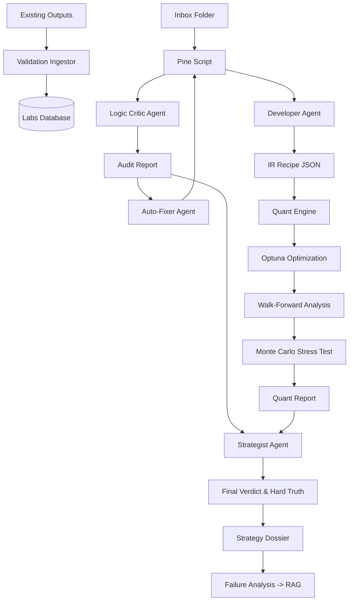

# Optimization Engine Pipeline: Multi-Agent Quant Lab

This document outlines the end-to-end autonomous pipeline for strategy optimization, validation, and assessment within the Optimization Engine.

## Pipeline Overview

The pipeline is orchestrated by `optimization_engine.py` and follows a multi-agent workflow. It is optimized for 8GB VRAM systems using a sequential model-loading strategy.

---

### Phase 0: Project Routing & Validation Ingestion
**File**: `optimization_engine.py`, `validation_ingestor.py`  
**Trigger**: Every startup.
1.  **Validation Ingestion**: Scans all `data/projects/*/output/*.csv` folders for TradingView backtest exports. Parses real-world Win Rate, Trades, and P&L into `internal_labs.db` to build a performance feedback loop.
2.  **Inbox Routing**: Checks `data/inbox/` for new `.pine` scripts. If found, it automatically creates a project directory, moves the files, and sets the context—removing the need for manual setup.

### Phase 1: Knowledge Ingestion (RAG)
**File**: `rag.py`  
**Engine**: SQLite + Sentence Transformers (Local)  
The engine begins by seeding its local knowledge base with known Pine Script bugs and repainting patterns.  
- **Detail**: It uses a local vector database to store "Logic Patterns". During the Critic phase, it retrieves relevant "bug snippets" to provide as context to the LLM.

### Phase 2: Market Context Fetching
**File**: `market_context.py`  
**Engine**: MCP (Model Context Protocol) Tools  
Fetches the current market regime snapshot (Volatility, Trend, Volume) for the target asset.  

### Phase 3: The Developer (IR Builder)
**File**: `quant_developer.py`, `ir_builder.py`  
**Model**: `Qwen2.5-Coder-7B` / Regex Rule Engine (Primary)  
Parses raw Pine Script into a language-agnostic Intermediate Representation (IR).  

### Phase 4: The Logic Critic (Static Audit)
**File**: `pine_critic.py`  
**Model**: `DeepSeek-Coder-V2-Lite-Instruct`  
A two-tier audit of the Pine Script logic for repainting and execution risks.  

### Phase 4.5: The Auto-Fixer (Structural Patching)
**File**: `auto_fixer.py`  
**Mechanism**: Safe Regex Rule Engine.
Automatically patches structural vulnerabilities identified by the Critic.
- **Example**: If a potential division-by-zero is found, the engine wraps the denominator in `math.max(var, 0.000001)`.
- **Result**: The final output script is "hardened" against runtime errors before being saved.

### Phase 5: The Quant Engine (Backtest & Optimization)
**File**: `quant_engine.py`  
**Engine**: NumPy / Pandas / Optuna (Pure Math)  
1.  **Regime Tagging**: Classifies every bar (Trend/Range/Vol).
2.  **5-Fold Walk-Forward Analysis (WFA)**: Optimizes on IS, validates on OOS across 5 chronological chunks.
3.  **Monte Carlo Simulation**: Shuffles trade sequences 1,000 times to calculate the **Luck Factor**.

### Phase 6: The Strategist (Synthesis)
**File**: `strategist.py`  
**Model**: `Mistral-Nemo-Instruct-2407` (12B)  
Synthesizes all technical and logic data into a final executive assessment.  
- **"Hard Truth" Narrative**: The LLM acts as a cynical Lead Strategist, providing brutally honest feedback on strategy viability.

### Phase 7: Artifact Generation & Self-Healing
**File**: `artifact_writer.py`, `failure_analyst.py`  
- **Dossier**: Generates the final `Strategy_Dossier.md` with best parameters and performance tables.
- **Refined Script**: Exports the final Pine Script with injected optimal parameters and structural fixes from Phase 4.5.

---

## Technical Flow Diagram

